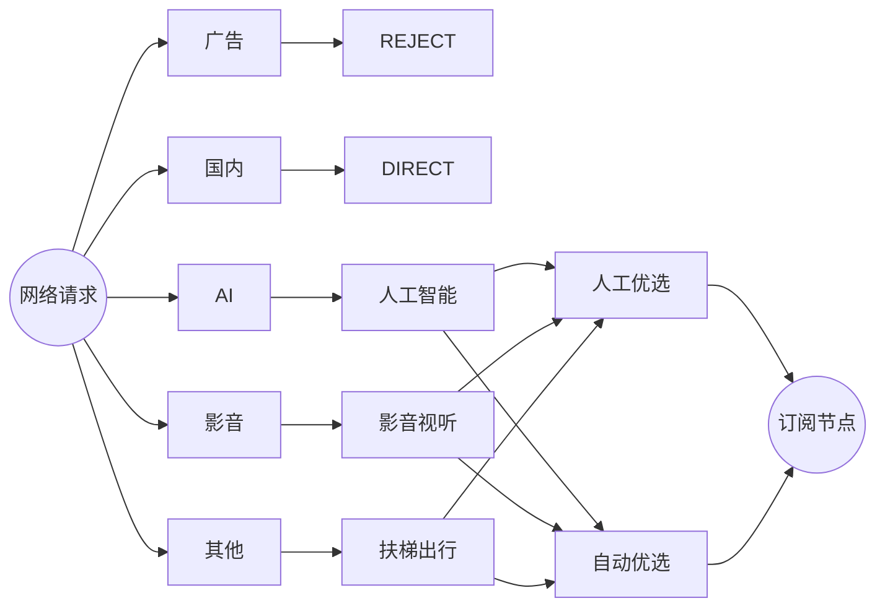
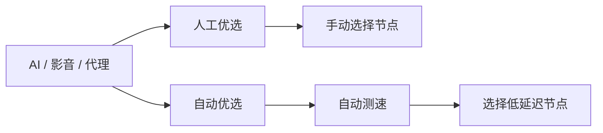
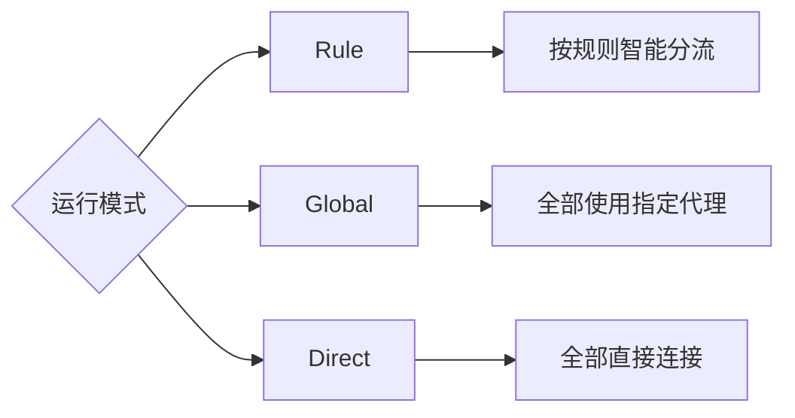
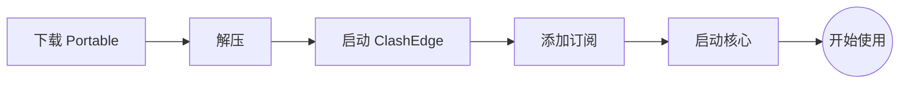
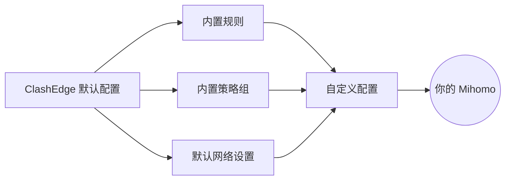

<div align="center">

# ClashEdge

**轻量、便携、开箱即用的 Windows Mihomo 客户端**

订阅负责节点，ClashEdge 负责分流与策略。


[下载](../../releases) · [规则库](https://github.com/akaspyrean/external)

</div>

---

## 界面

<table>
<tr>
<td width="50%">

</td>
<td width="50%">

</td>
</tr>
<tr>
<td align="center"><b>概览</b></td>
<td align="center"><b>代理</b></td>
</tr>
<tr>
<td>

</td>
<td>

</td>
</tr>
<tr>
<td align="center"><b>配置</b></td>
<td align="center"><b>设置</b></td>
</tr>
</table>

---

## 开箱即用

<table>
<tr>
<td align="center" width="20%"><b>📦 便携</b><br><sub>解压即用</sub></td>
<td align="center" width="20%"><b>🧭 分流</b><br><sub>规则预置</sub></td>
<td align="center" width="20%"><b>⚡ 优选</b><br><sub>自动测速</sub></td>
<td align="center" width="20%"><b>🛡️ 拦截</b><br><sub>广告过滤</sub></td>
<td align="center" width="20%"><b>🎛️ 可控</b><br><sub>支持自定义</sub></td>
</tr>
</table>

<br>

|        |                        |
| ------ | ---------------------- |
| **节点** | 导入订阅即可                 |
| **模式** | Rule / Global / Direct |
| **策略** | 人工优选 / 自动优选            |
| **网络** | 系统代理 / TUN             |
| **管理** | 订阅更新 / 配置编辑 / 热重载      |
| **状态** | 延迟 / 流量 / 连接 / 日志      |
| **界面** | 中文 / English · 浅色 / 深色 |

---

## 智能分流



### 内置规则

<table>
<tr>
<td align="center"><b>🛡️ 广告</b><br><code>ad.yaml</code><br>↓<br><b>REJECT</b></td>
<td align="center"><b>🇨🇳 直连</b><br><code>direct.yaml</code><br>↓<br><b>DIRECT</b></td>
<td align="center"><b>✦ AI</b><br><code>ai.yaml</code><br>↓<br><b>人工智能</b></td>
<td align="center"><b>▶ 影音</b><br><code>media.yaml</code><br>↓<br><b>影音视听</b></td>
<td align="center"><b>↗ 代理</b><br><code>proxy.yaml</code><br>↓<br><b>扶梯出行</b></td>
</tr>
</table>

规则来自 [External](https://github.com/akaspyrean/external)，随程序提供并支持更新。

---

## 两种节点选择



<table>
<tr>
<td width="50%" align="center">
<h3>人工优选</h3>
手动决定使用哪个节点
</td>
<td width="50%" align="center">
<h3>自动优选</h3>
自动测速并选择低延迟节点
</td>
</tr>
</table>

---

## 三种模式



日常使用选择 **Rule** 即可。

---

## 30 秒开始



从 [Releases](../../releases) 下载：

```text
ClashEdge-portable-<version>-win64.zip
```

解压后运行：

```text
ClashEdge.exe
```

支持：

**中文路径 · 空格路径 · 更换目录 · 更换盘符 · 整体迁移**

---

## 内置，但不锁死



默认配置用于开箱即用。

需要更细的控制时，可以自行调整：

`规则` · `Rule Provider` · `代理组` · `DNS` · `TUN` · `Mihomo 配置`

---

<div align="center">

### ClashEdge

**下载 · 解压 · 添加订阅 · 使用**

[Releases](../../releases) · [External Rules](https://github.com/akaspyrean/external)

<sub>MIT License · 仅用于网络配置、代理管理与技术研究</sub>

</div>
