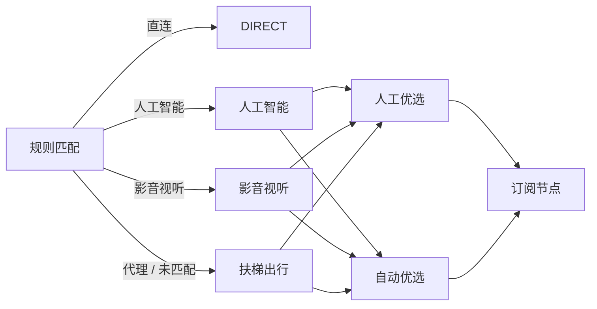

<div align="center">

# ClashEdge


**轻量、便携的 Windows Mihomo 客户端**

基于 **Tauri 2 + Rust + Vue 3 + Mihomo**，解压即用。

</div>

## 界面

<table>
<tr>
<td width="50%"></td>
<td width="50%"></td>
</tr>
<tr>
<td align="center">概览</td>
<td align="center">代理</td>
</tr>
<tr>
<td></td>
<td></td>
</tr>
<tr>
<td align="center">配置</td>
<td align="center">设置</td>
</tr>
</table>

## 特性

| 功能 | 说明 |
| --- | --- |
| 便携运行 | 解压即用，程序与数据分离，可整体迁移 |
| Mihomo | 内置 Mihomo 内核，无需额外安装 |
| 分流规则 | Rule / Global / Direct，人工选择 / 自动优选，场景化分流 |
| 配置管理 | 订阅导入、更新、热重载及配置编辑 |
| 系统集成 | 系统代理、TUN、托盘、开机启动 |
| 状态监控 | 延迟、连接、流量、日志 |
| 使用体验 | 中文 / English，浅色 / 深色 |

## 使用

1. 从 [Releases](../../releases) 下载：

```text
ClashEdge-portable-<version>-win64.zip
```

2. 解压到任意目录。

3. 运行：

```text
ClashEdge.exe
```

4. 在「配置」中添加订阅并启动核心。

> 支持 Windows 10 / 11、中文路径、空格路径及整体目录迁移。


## 分流

ClashEdge 内置 [External](https://github.com/akaspyrean/external) 分流规则，默认每日更新；订阅提供节点，规则与策略开箱即用，并支持自定义配置与规则。



| 类型   | 策略     | 规则                                                                                |
| ---- | ------ | --------------------------------------------------------------------------------- |
| 直连   | DIRECT | [direct.yaml](https://github.com/akaspyrean/external/blob/main/rules/direct.yaml) |
| 人工智能 | 人工智能   | [ai.yaml](https://github.com/akaspyrean/external/blob/main/rules/ai.yaml)         |
| 影音视听 | 影音视听   | [media.yaml](https://github.com/akaspyrean/external/blob/main/rules/media.yaml)   |
| 代理   | 扶梯出行   | [proxy.yaml](https://github.com/akaspyrean/external/blob/main/rules/proxy.yaml)   |
| 未匹配  | 扶梯出行   | MATCH                                                                             |


## 许可

ClashEdge 源代码采用 [MIT License](LICENSE)。Mihomo、Wintun、GeoData 等第三方组件保留各自许可证，详见 [THIRD_PARTY_NOTICES.md](THIRD_PARTY_NOTICES.md)。

## 声明

本项目仅用于网络配置、代理管理与技术研究。

使用者应自行确认相关配置、规则及网络服务符合所在地法律法规及服务条款。
