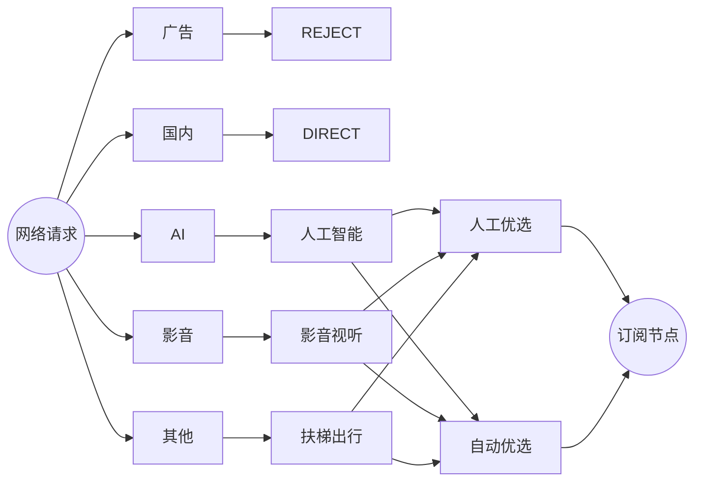
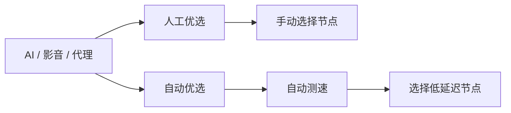
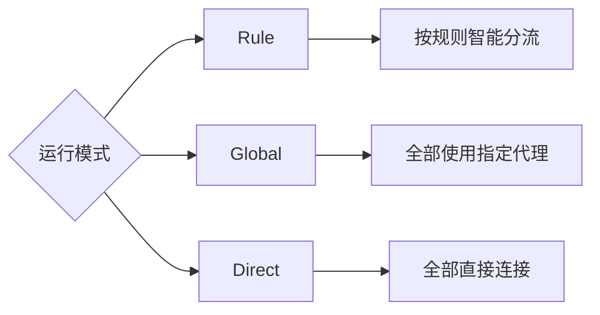
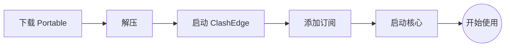
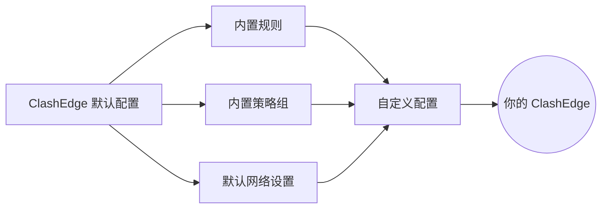

<div align="center">

# ClashEdge

**轻量、开箱即用的 Mihomo 客户端（Windows 正式发布 / Android 实验性规划）**

订阅提供节点，ClashEdge 负责分流与策略。内置规则开箱即用，也可自由配置。


[下载](../../releases) · [规则库](https://github.com/akaspyrean/external)

</div>

---

## 平台

| | **ClashEdge for Windows** | **ClashEdge for Android（实验性 / 规划中）** |
| --- | --- | --- |
| 定位 | Lightweight / Portable / Windows-first | Lightweight / Simple / Mihomo-based |
| 内核接入 | Mihomo（sidecar）+ WinTUN | Mihomo（Android AAR / JNI） |
| 网络方式 | 系统代理 + TUN（Wintun） | Android VpnService（TUN） |
| 形态 | 便携目录（根启动器 + App/ + Data/） | APK |
| 前端实现 | Tauri（Rust + Vue 3） | Kotlin + Jetpack Compose |

两个平台共享品牌、产品定位、默认规则体系与相近的信息架构，但平台能力各自独立实现。

> **Android 为实验性/规划中，不包含在正式发布链路内**：当前缺少 gradle wrapper（无可执行的 `gradlew`/`gradlew.bat`）、Mihomo AAR/JNI 为占位实现（无真实 VPN 内核集成）、无 release 签名配置，因此**无法提供真实 VPN 服务**。现状与进入发布范围的前置条件清单见 [`apps/android/README.md`](apps/android/README.md)。

---

## 界面

<table>
<tr>
<td width="50%">

</td>
<td width="50%">

</td>
</tr>
<tr>
<td align="center"><b>概览</b></td>
<td align="center"><b>代理</b></td>
</tr>
<tr>
<td>

</td>
<td>

</td>
</tr>
<tr>
<td align="center"><b>配置</b></td>
<td align="center"><b>设置</b></td>
</tr>
</table>

---

## 开箱即用

<table>
<tr>
<th width="20%" nowrap>📦&nbsp;便携运行</th>
<th width="20%" nowrap>🔗&nbsp;订阅管理</th>
<th width="20%" nowrap>🧭&nbsp;分流策略</th>
<th width="20%" nowrap>🌐&nbsp;系统网络</th>
<th width="20%" nowrap>📊&nbsp;状态体验</th>
</tr>

<tr>
<td>解压即用</td>
<td>订阅导入</td>
<td>内置规则</td>
<td>系统代理</td>
<td>延迟监测</td>
</tr>

<tr>
<td>整体迁移</td>
<td>订阅更新</td>
<td>Rule / Global / Direct</td>
<td>TUN</td>
<td>流量 / 连接</td>
</tr>

<tr>
<td>中文 / 空格路径</td>
<td>配置编辑</td>
<td>人工优选 / 自动优选</td>
<td>Mihomo 接入</td>
<td>日志</td>
</tr>

<tr>
<td>程序与数据分离</td>
<td>热重载</td>
<td>AI / 影音 / 广告 / 代理分流</td>
<td>—</td>
<td>中文 / English</td>
</tr>

<tr>
<td>—</td>
<td>—</td>
<td>广告拦截 <code>ad.yaml</code></td>
<td>—</td>
<td>浅色 / 深色</td>
</tr>
</table>

---

## 智能分流



---

## 两种节点


---

## 三种模式



---

## 30 秒开始



从 [Releases](../../releases) 下载：

```text
ClashEdge-portable-win64.zip
```

解压后运行：

```text
ClashEdge.exe
```

---

## 内置，但不锁死



默认配置用于开箱即用。

需要更细的控制时，可以自行调整：

`规则` · `Rule Provider` · `代理组` · `DNS` · `TUN` · `Mihomo 配置`

---

<div align="center">

### ClashEdge

**下载 · 解压 · 添加订阅 · 使用**

[Releases](../../releases) · [External Rules](https://github.com/akaspyrean/external)

<sub>MIT License · 仅用于网络配置、代理管理与技术研究</sub>

</div>
