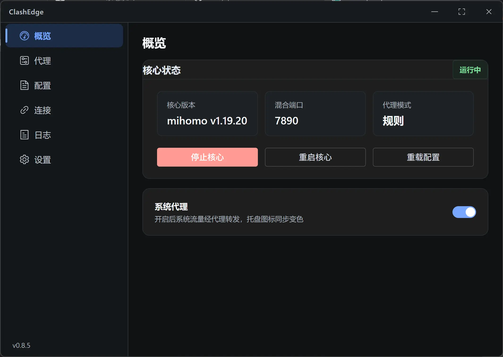
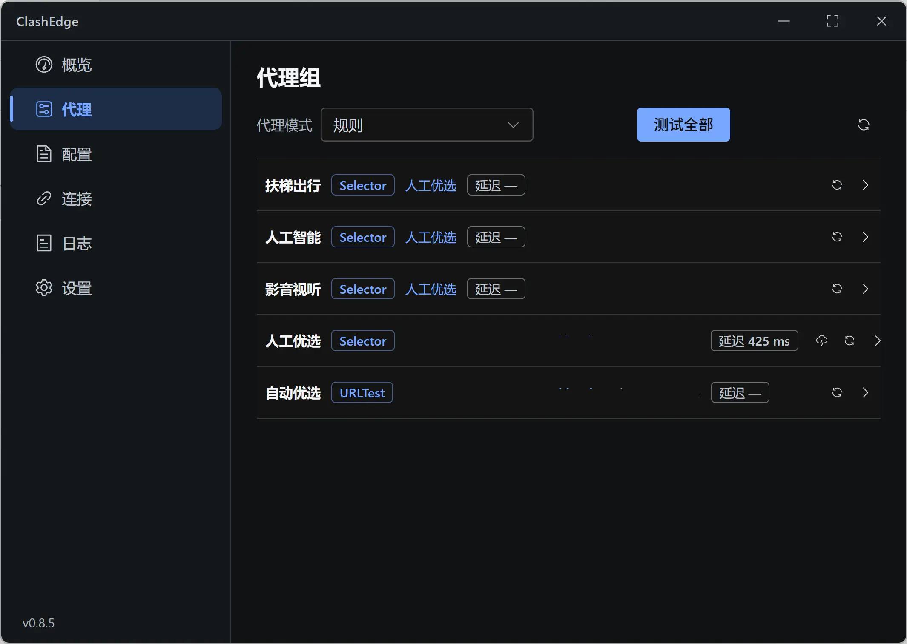
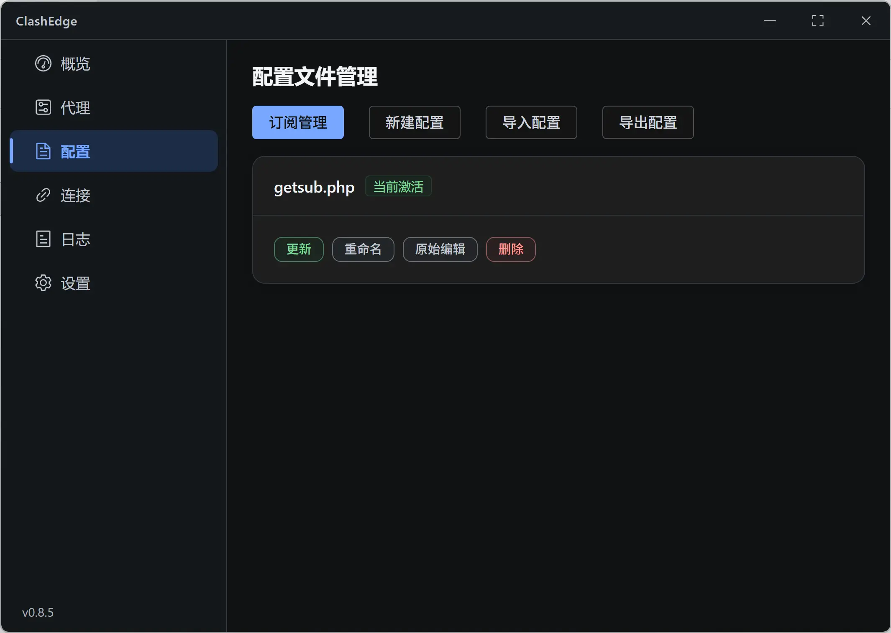
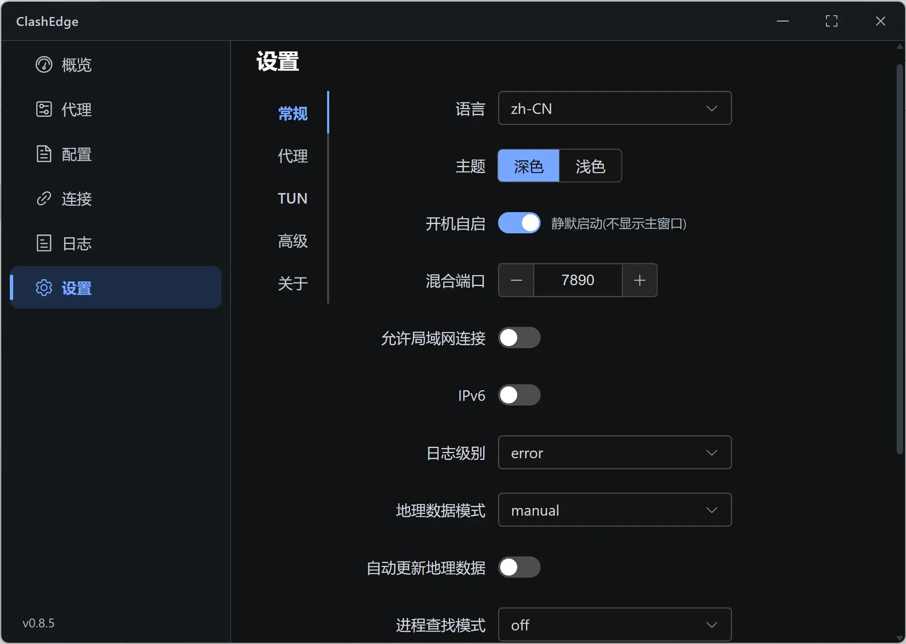
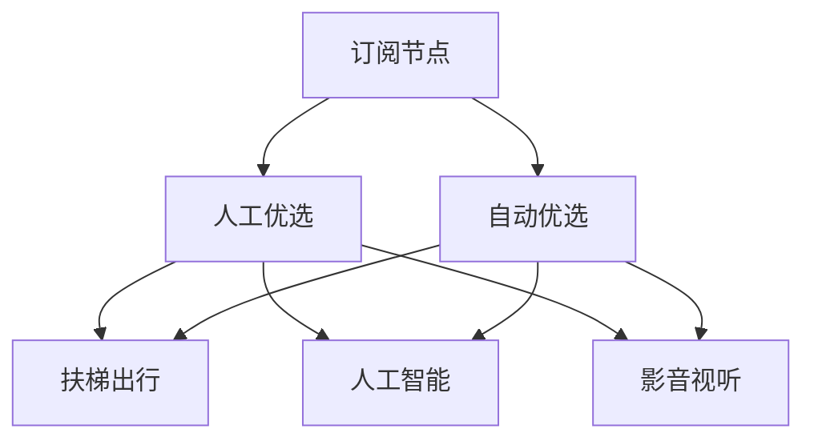

<div align="center">

# ClashEdge


**轻量、便携的 Windows Mihomo 客户端**

基于 **Tauri 2 + Rust + Vue 3 + Mihomo**，解压即用。

</div>

## 界面

<table>
<tr>
<td width="50%"></td>
<td width="50%"></td>
</tr>
<tr>
<td align="center">概览</td>
<td align="center">代理</td>
</tr>
<tr>
<td></td>
<td></td>
</tr>
<tr>
<td align="center">配置</td>
<td align="center">设置</td>
</tr>
</table>

## 特性

| 功能      | 说明                                 |
| ------- | ---------------------------------- |
| 便携运行    | 解压即用，程序与数据分离，可整体迁移                 |
| Mihomo  | 内置 Mihomo 内核，无需额外安装                |
| 代理模式    | Rule / Global / Direct             |
| 节点选择    | 人工选择 / 自动优选                        |
| 智能分流    | 人工智能 / 影音视听 / 默认代理                 |
| 订阅管理    | 导入、更新、热重载                          |
| 配置管理    | 新建、导入、导出、重命名、原始编辑                  |
| Windows | 系统代理、TUN、托盘、开机启动                   |
| 状态监控    | 延迟、连接、流量、日志                        |
| 界面      | 中文 / English、浅色 / 深色               |
| 安全      | Controller Secret、SSRF 防护、CSP、路径限制 |

## 使用

1. 从 [Releases](../../releases) 下载：

```text
ClashEdge-portable-<version>-win64.zip
```

2. 解压到任意目录。

3. 运行：

```text
ClashEdge.exe
```

4. 在「配置」中添加订阅并启动核心。

> 支持 Windows 10 / 11、中文路径、空格路径及整体目录迁移。

## 分流

ClashEdge 内置 [External](https://github.com/akaspyrean/external) 分流规则，开箱即用，并支持自定义配置与规则。



| 规则   | 策略     |
| ---- | ------ |
| 直连   | DIRECT |
| 人工智能 | 人工智能   |
| 影音视听 | 影音视听   |
| 代理   | 扶梯出行   |
| 未匹配  | 扶梯出行   |

内置规则：

| 类型     | 来源                                                                                |
| ------ | --------------------------------------------------------------------------------- |
| Direct | [direct.yaml](https://github.com/akaspyrean/external/blob/main/rules/direct.yaml) |
| AI     | [ai.yaml](https://github.com/akaspyrean/external/blob/main/rules/ai.yaml)         |
| Media  | [media.yaml](https://github.com/akaspyrean/external/blob/main/rules/media.yaml)   |
| Proxy  | [proxy.yaml](https://github.com/akaspyrean/external/blob/main/rules/proxy.yaml)   |

规则默认每日更新。

## Portable

```text
ClashEdge/
├── ClashEdge.exe
├── App/       # 程序
├── Data/      # 配置、订阅、日志、GeoData
└── Other/     # 发行辅助文件
```

## 技术

|          |                              |
| -------- | ---------------------------- |
| Desktop  | Tauri 2                      |
| Backend  | Rust                         |
| Frontend | Vue 3 + Pinia + Element Plus |
| Core     | Mihomo                       |
| TUN      | go-tun2socks + Wintun        |
| Platform | Windows 10 / 11              |

## 开发

环境：

* Node.js 20 LTS
* Rust stable
* WebView2

安装依赖：

```powershell
cd tauri-scaffold
npm ci
```

开发：

```powershell
npm run tauri -- dev
```

测试：

```powershell
cd src-tauri
cargo test
```

构建：

```powershell
cd ..
npm run tauri -- build --no-bundle
```

Portable：

```powershell
.\tools\build-portable.ps1
```

完整构建：

```powershell
.\tools\build-portable.ps1 -Build
```

## 项目

```text
.
├── tauri-scaffold/       # Tauri / Vue / Rust
├── portable-template/    # Portable 模板
├── tools/                # 构建与打包
├── docs/                 # 文档与图片
└── .github/workflows/    # CI / Release
```

## 许可

ClashEdge 源代码采用 [MIT License](LICENSE)。

Mihomo、Wintun、GeoData 等第三方组件保留各自许可证，详见 [THIRD_PARTY_NOTICES.md](THIRD_PARTY_NOTICES.md)。

## 声明

本项目仅用于网络配置、代理管理与技术研究。

使用者应自行确认相关配置、规则及网络服务符合所在地法律法规及服务条款。
